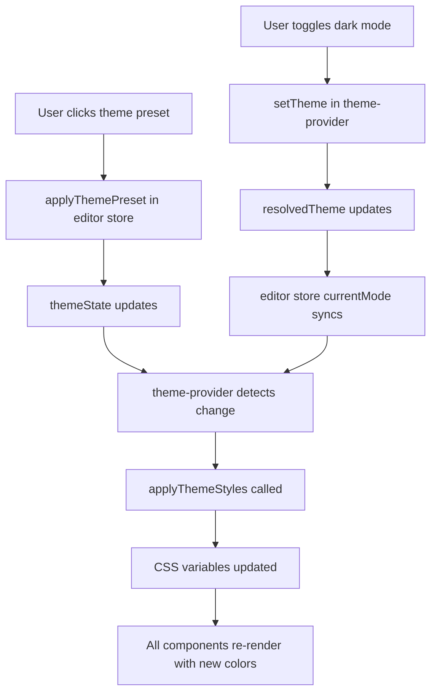

# Theme System Integration Guide

## Overview
The theme system has been fully integrated to synchronize the `ThemeSwitch` component, theme presets, and CSS variables. When you click on a theme preset button or toggle dark/light mode, all components will update automatically.

## Architecture

### 1. **Editor Store** (`src/stores/editor-store.ts`)
- Central source of truth for theme state
- Contains `themeState` with:
  - `styles`: Theme color values for light and dark modes
  - `currentMode`: Current mode ('light' or 'dark')
  - `preset`: Name of the active preset
  - `hslAdjustments`: Optional color adjustments

### 2. **Theme Provider** (`src/context/theme-provider.tsx`)
- Manages light/dark/system theme switching
- Syncs `currentMode` with the editor store
- Applies theme styles to CSS variables when theme changes
- Two-way synchronization:
  - Theme switch → Updates editor store
  - Editor store → Updates CSS variables

### 3. **Theme Applier** (`src/utils/apply-theme-styles.ts`)
- Utility function that applies theme styles to CSS custom properties
- Updates `document.documentElement.style` with color values
- Called automatically when:
  - Theme preset is applied
  - Light/dark mode is toggled
  - Theme styles are modified

### 4. **Theme Switch** (`src/components/ThemeSwitch.tsx`)
- UI component for toggling light/dark/system mode
- Updates both theme provider and editor store
- Syncs `resolvedTheme` with editor store's `currentMode`

## How It Works



## Usage Examples

### Applying a Theme Preset

```tsx
import { useEditorStore } from '@/stores/editor-store';

function MyComponent() {
  const { applyThemePreset } = useEditorStore();
  
  return (
    <button onClick={() => applyThemePreset('ocean-breeze')}>
      Apply Ocean Breeze Theme
    </button>
  );
}
```

### Accessing Current Theme

```tsx
import { useEditorStore } from '@/stores/editor-store';

function MyComponent() {
  const { themeState } = useEditorStore();
  const { currentMode, preset, styles } = themeState;
  
  return (
    <div>
      <p>Current mode: {currentMode}</p>
      <p>Active preset: {preset}</p>
      <p>Primary color: {styles[currentMode].primary}</p>
    </div>
  );
}
```

### Toggling Light/Dark Mode

```tsx
import { useTheme } from '@/context/theme-provider';

function MyComponent() {
  const { theme, setTheme, resolvedTheme } = useTheme();
  
  return (
    <div>
      <button onClick={() => setTheme('light')}>Light</button>
      <button onClick={() => setTheme('dark')}>Dark</button>
      <button onClick={() => setTheme('system')}>System</button>
      <p>Current: {resolvedTheme}</p>
    </div>
  );
}
```

## Key Features

✅ **Automatic Sync**: Theme mode and preset changes sync across all components  
✅ **Persistent State**: Theme preferences persist in localStorage via Zustand  
✅ **CSS Variable Updates**: All color values update dynamically via CSS custom properties  
✅ **Type Safety**: Full TypeScript support with proper types for all theme properties  
✅ **System Preference Support**: Respects OS dark/light mode preference  
✅ **Preset System**: 50+ built-in theme presets ready to use  
✅ **History Support**: Undo/redo functionality for theme changes  

## CSS Variables

All theme values are exposed as CSS custom properties:

```css
/* Colors */
--background
--foreground
--primary
--primary-foreground
--secondary
--secondary-foreground
--muted
--muted-foreground
--accent
--accent-foreground
--destructive
--destructive-foreground
--border
--input
--ring

/* Charts */
--chart-1 through --chart-5

/* Sidebar */
--sidebar
--sidebar-foreground
--sidebar-primary
--sidebar-primary-foreground
--sidebar-accent
--sidebar-accent-foreground
--sidebar-border
--sidebar-ring

/* Typography */
--font-sans
--font-serif
--font-mono
--letter-spacing

/* Layout */
--radius
--spacing

/* Shadows */
--shadow-color
--shadow-opacity
--shadow-blur
--shadow-spread
--shadow-offset-x
--shadow-offset-y
```

## Testing

To verify the theme system is working:

1. **Start the dev server**:
   ```bash
   pnpm dev
   ```

2. **Open the homepage** with theme presets section

3. **Click different theme preset buttons** - you should see:
   - Colors change immediately
   - All UI components update
   - Smooth transitions between themes

4. **Toggle dark/light mode** using the ThemeSwitch:
   - Moon/sun icon in the header
   - CSS variables update for current mode
   - Preview maintains correct colors

5. **Check browser DevTools**:
   ```javascript
   // In console
   console.log(document.documentElement.style.getPropertyValue('--primary'));
   // Should show the current primary color value
   ```

## Troubleshooting

### Theme preset not applying

**Check**:
- Editor store is being used correctly
- `applyThemePreset` is called with a valid preset name
- No console errors related to color parsing

### Dark mode colors not switching

**Check**:
- `currentMode` in editor store matches the theme
- `theme-provider` is wrapping your app
- CSS variables are being set in DevTools

### Colors look wrong

**Check**:
- Color format is supported (hex, hsl, rgb, oklch)
- Color values are valid CSS color strings
- No CSS specificity issues overriding custom properties

## Files Modified

1. ✅ `src/components/ThemeSwitch.tsx` - Syncs with editor store
2. ✅ `src/context/theme-provider.tsx` - Applies theme styles
3. ✅ `src/utils/apply-theme-styles.ts` - NEW - Applies CSS variables
4. ✅ `src/config/theme.ts` - Simplified initialization
5. ✅ `src/stores/editor-store.ts` - Already working correctly

## Next Steps

You can now:
- Add more theme presets to `src/utils/theme-presets.ts`
- Create custom theme editor UI
- Export/import theme configurations
- Build a theme marketplace
- Add theme animations and transitions

Enjoy your fully integrated theme system! 🎨
